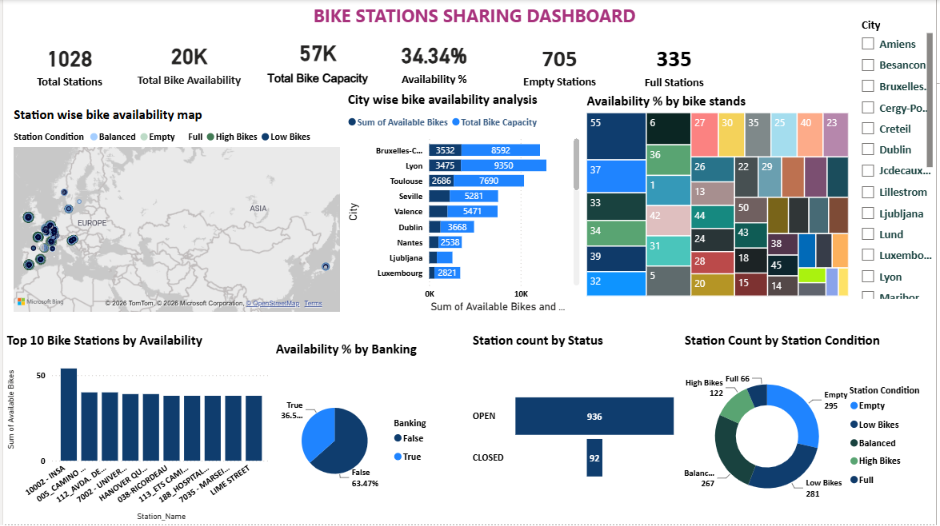

# 🚲 Bike Station Sharing Dashboard

## 📌 Overview

This project showcases an interactive **Power BI dashboard** built to analyze the performance of a bike-sharing system across multiple cities. The dashboard provides insights into station distribution, bike availability, operational status, city-wise performance, and station conditions, helping stakeholders monitor system efficiency and optimize bike allocation.

---

## 🎯 Objectives

- Analyze the geographic distribution of bike stations.
- Compare bike and stand availability across cities.
- Identify the top stations with the highest bike availability.
- Monitor operational status (Open vs. Closed).
- Evaluate station conditions (Empty, Full, Low Bikes, High Bikes).
- Analyze bike availability based on banking-enabled stations.
- Measure overall bike availability and occupancy.

---

## 📂 Dataset

The dataset includes the following information:

- Station ID
- Station Name
- Address
- City
- Latitude & Longitude
- Total Bike Stands
- Available Bikes
- Available Bike Stands
- Banking
- Bonus
- Status
- Timestamp

---

## 🧹 Data Cleaning

The dataset was cleaned and transformed using **Power Query Editor**.

- Standardized column names
- Split location into Latitude and Longitude
- Converted appropriate data types
- Replaced missing station addresses with **"Unknown"**
- Formatted city names
- Created calculated columns:
  - Empty Status
  - Station Condition
  - Is Latest

---

## 📊 Dashboard Features

The dashboard contains the following visualizations:

- **KPI Cards**
  - Total Stations
  - Total Bike Availability
  - Total Bike Capacity
  - Availability %
  - Empty Stations
  - Full Stations

- **Map**
  - Bike Station Distribution

- **Bar Chart**
  - City-wise Bike & Stand Availability

- **Treemap**
  - Availability by Bike Stands

- **Column Chart**
  - Top 10 Stations by Bike Availability

- **Pie Chart**
  - Availability by Banking

- **Funnel Chart**
  - Station Count by Operational Status

- **Donut Chart**
  - Station Condition Distribution

---

## 📐 DAX Measures

- Total Stations
- Total Bike Availability
- Total Bike Capacity
- Availability %
- Empty Stations
- Full Stations
- Station Count
- Occupancy %
- Average Bikes per Station

---

## 📈 Key Insights

- **Bruxelles-Capitale** has the highest bike availability, indicating a strong bike supply.
- **Lyon** has the largest bike stand capacity, reflecting a well-developed bike-sharing network.
- **Station 10002-INSA** has the highest number of bike stands.
- The Top 10 stations maintain the highest bike availability, suggesting either high supply or lower demand.
- Around **63.47%** of stations are non-banking enabled.
- Most stations are operational, with **936 Open** stations compared to **92 Closed** stations.
- A large number of stations are empty, indicating high bike usage or the need for improved bike redistribution.

---

## 🛠️ Tools Used

- **Power BI Desktop**
- **Power Query**
- **DAX**

---

## ✅ Conclusion

The Bike Station Sharing Dashboard provides a comprehensive view of station performance, bike availability, and operational efficiency across multiple cities. The analysis highlights strong infrastructure in cities like **Bruxelles-Capitale** and **Lyon**, while also identifying opportunities to improve bike redistribution due to the presence of many empty stations. Overall, the dashboard enables data-driven decision-making to enhance service quality and optimize resource allocation.

---

